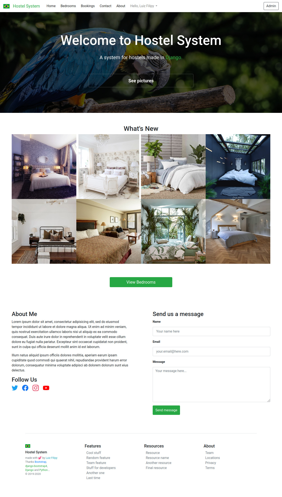
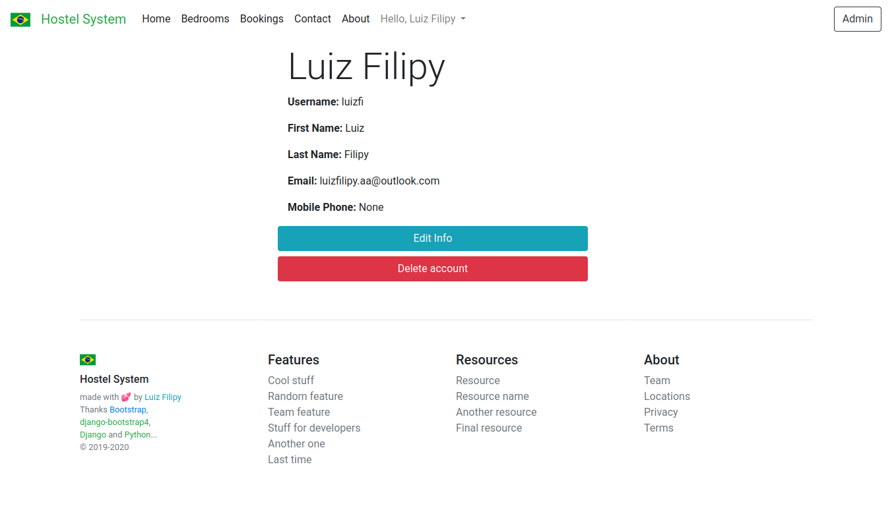
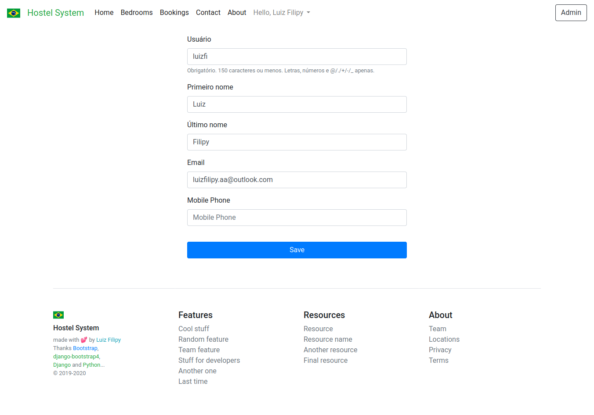
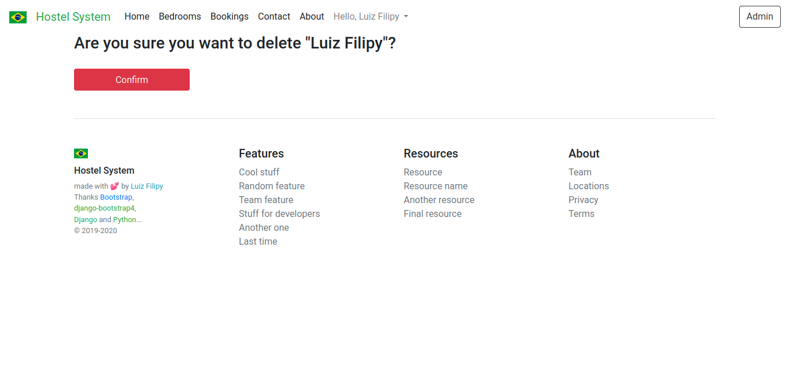
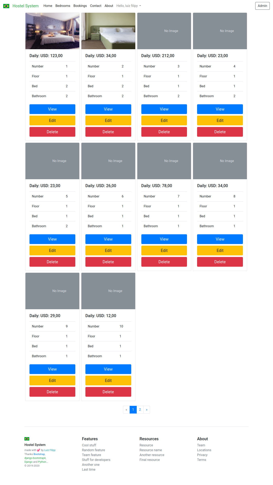
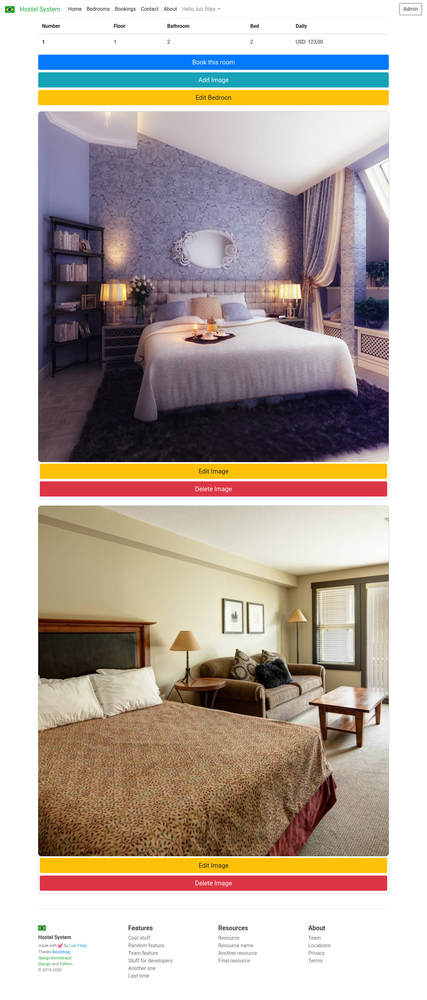
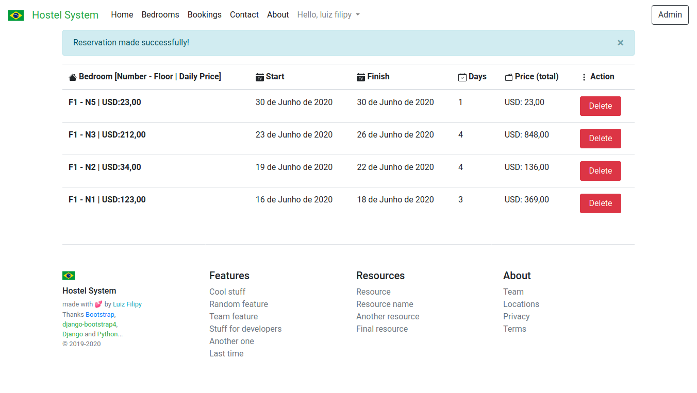

# Hostel System

## Home


## User
### user info


### user update info


### delete user


## Bedrooms


### bedroom info


## Bookings


### Booking Delete


# Rest API

> header: Authorization: Token <token_here>

## Core

### Get/Create access token
| Endpoint | Method | Auth | Body (JSON) |
|:---:|:---:|:---:|:---:|
| `/get-token/` | POST | No | `username` (email), `password` |

##### Description
>Endpoint to log in and receive the access token, providing username (email) and password

##### Output:
```json
{
  "token": "dac9c44bf18f1d370d67bb6177dea7a83b37e105"
}
```

### SignUp
| Endpoint | Method | Auth | Body (JSON) |
|:---:|:---:|:---:|:---:|
| `/api/signup/` | POST | No | `username`, `email`, `password` (campos obrigatórios) |

##### Description
>Endpoint to create a user in the system and return the access token of this user created

##### Output:
```json
{
  "token": "dac9c44bf18f1d370d67bb6177dea7a83b37e105"
}
```

### Logout
| Endpoint | Method | Auth | Body (JSON) |
|:---:|:---:|:---:|:---:|
| `/api/logout/` | POST | Yes | None |

##### Description
>Endpoint to logout of the system. The access token is destroyed

##### Output:
```http request
201 OK
```

## Client

### Get info
| Endpoint | Method | Auth | Body (JSON) |
|:---:|:---:|:---:|:---:|
| `/my/api/` | GET | Yes | None |

##### Description
>Endpoint to get user info

##### Output:
```http request
201 OK
{
   "username": "",
   "first_name": "",
   "last_name": "",
   "email": "",
   "mobile_phone": ""
}
```

### Update info
| Endpoint | Method | Auth | Body (JSON) |
|:---:|:---:|:---:|:---:|
| `/my/api/` | PATCH (partial) PUT (full) | Yes | Yes |

##### Description
>Endpoint to update user info.

##### Output:
```http request
201 OK
{
   "username": "",
   "first_name": "",
   "last_name": "",
   "email": "",
   "mobile_phone": ""
}
```

### Delete user
| Endpoint | Method | Auth | Body (JSON) |
|:---:|:---:|:---:|:---:|
| `/my/api/` | DELETE | Yes | No |

##### Description
>Endpoint to delete user.

##### Output:
```http request
204 No Content
```

## Bedroom

### List Bedrooms
| Endpoint | Method | Auth | Body (JSON) |
|:---:|:---:|:---:|:---:|
| `/bedroom/api/` | GET | No | No |

##### Description
>Endpoint to list all bedrooms.

##### Output:
```json
[{bedrooms}]
```

### Get Bedroom Info
| Endpoint | Method | Auth | Body (JSON) |
|:---:|:---:|:---:|:---:|
| `/bedroom/api/<id:bedroom>/` | GET | No | No |

##### Description
>Endpoint to list bedroom by id.

##### Output:
```json
{bedroom}
```

##### Obs
> Create (POST), Update (PUT and PATCH) and Delete (DELETE) a bedroom is unavailable.

## Booking

### Get all booking
| Endpoint | Method | Auth | Body (JSON) |
|:---:|:---:|:---:|:---:|
| `/booking/api/` | GET | Yes | No |

##### Description
>Endpoint to list all booking by client id.

##### Output:
```json
[]
```

### Get booking by pk
| Endpoint | Method | Auth | Body (JSON) |
|:---:|:---:|:---:|:---:|
| `/booking/api/<pk>/` | GET | Yes | No |

##### Description
>Endpoint to get booking info by booking id.

##### Output:
```json
{
  "id": 30,
  "client": 1,
  "bedroom": 1,
  "total": "246.00",
  "start": "2020-07-12",
  "finish": "2020-07-13"
}
```

### Delete booking by pk
| Endpoint | Method | Auth | Body (JSON) |
|:---:|:---:|:---:|:---:|
| `/booking/api/<pk>/` | DELETE | Yes | No |

##### Description
>Endpoint to delete booking by booking id and change 'is_available=False' to 'is_available=True' in bedroom object.

##### Output:
```json
```

##### Obs
> Update (PUT and PATCH) a booking is unavailable.
