# Hostel System

## Home
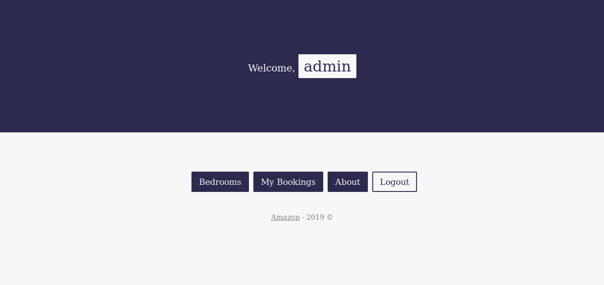

## User
### user info
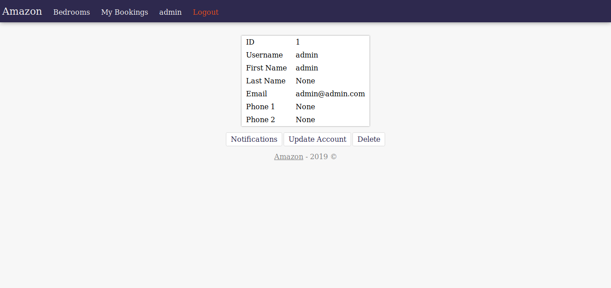

### user update info
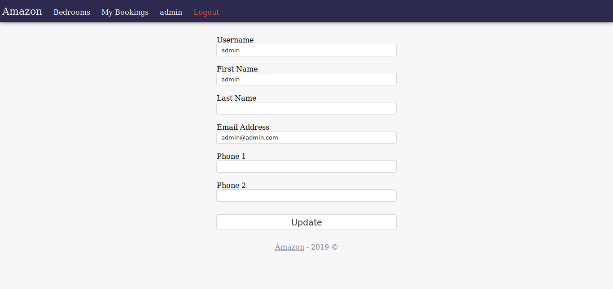

### delete user
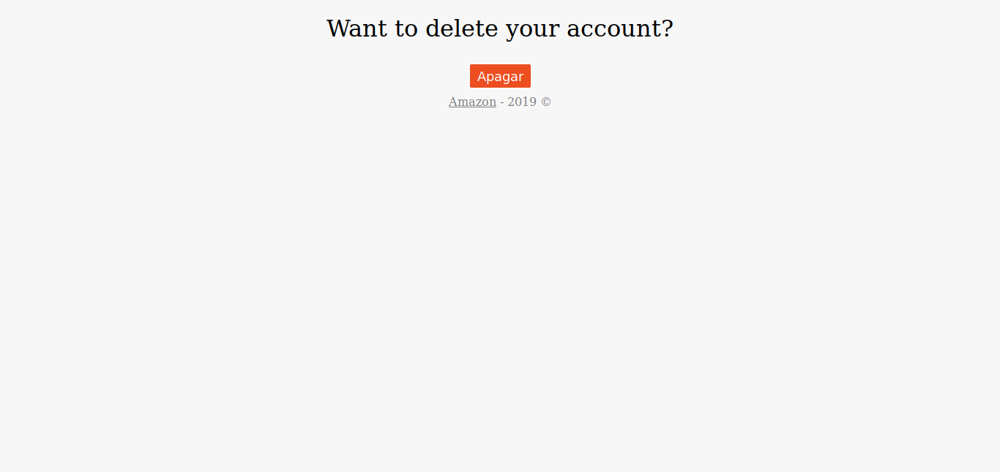

## Notifications
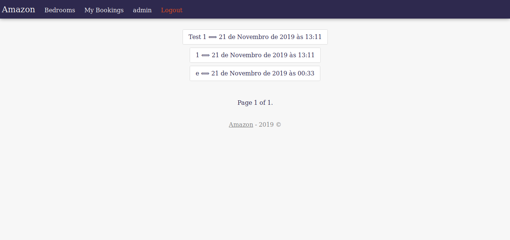

### notification
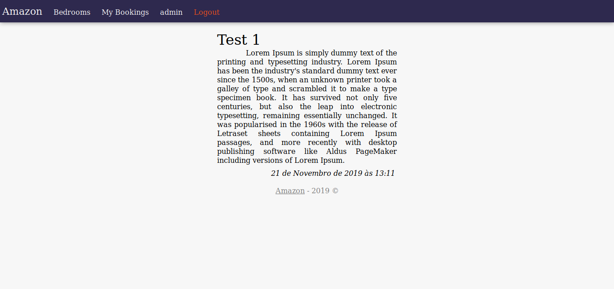

## Bedrooms
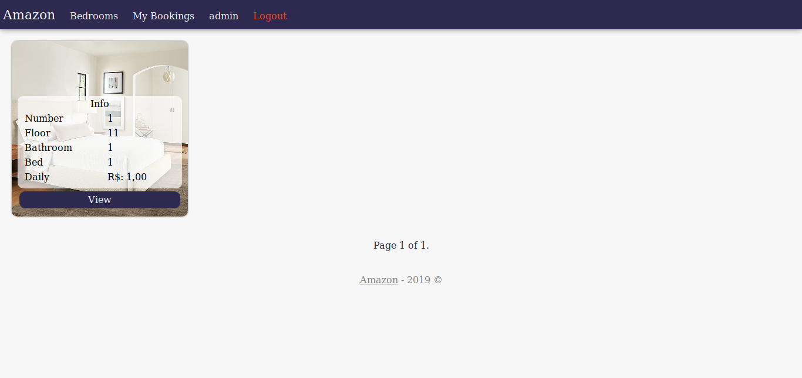

### bedroom info
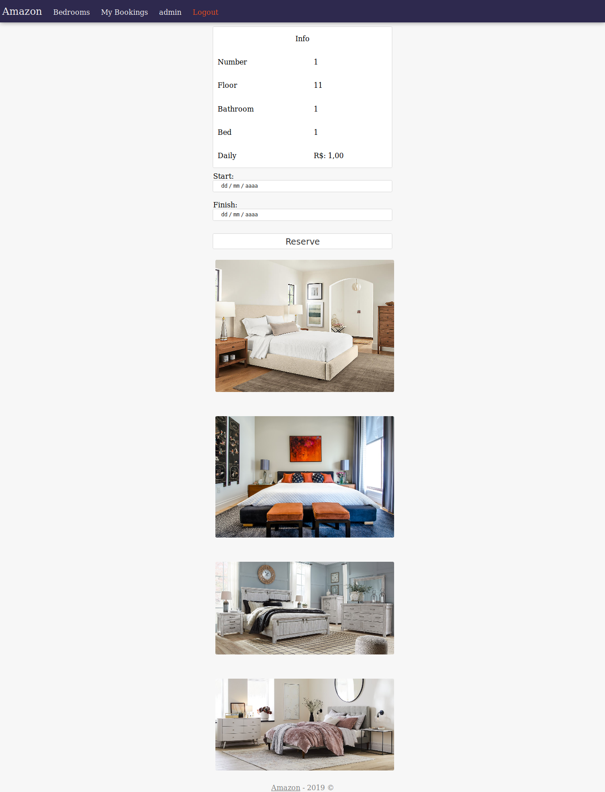

## Bookings
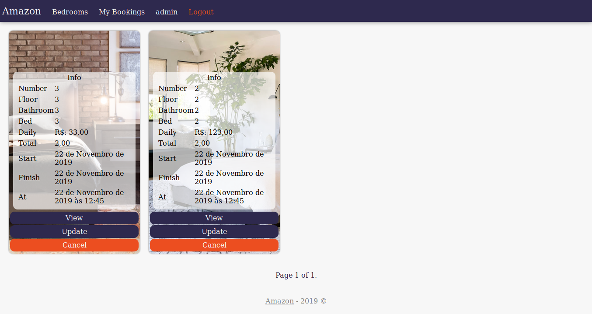

### Booking update
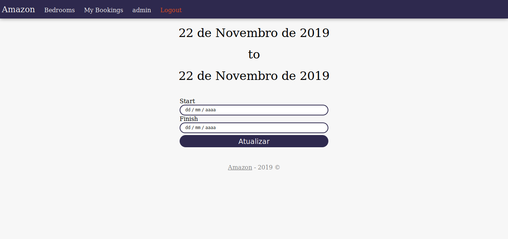

### Booking Delete

## About
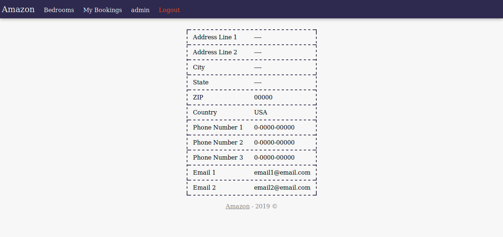

# Rest API

### Bedroom
| Method | Routes | Is Authenticated | Header | Body |
|-|-|-|-|-|
| `GET` | `/api/bedroom` | no | no | no |

### Client
| Method | Routes | Is Authenticated | Header | Body |
|-|-|-|-|-|
| `GET` | `/api/client` | yes | `Authorization: Token <token>` | no |
| `GET` | `/api/client/<id>` | yes | `Authorization: Token <token>` | no |
| `PUT` | `/api/client/<id>` | yes | `Authorization: Token <token>` | `username, first_name, last_name, email, phone1, phone2` |
| `DELETE` | `/api/client/<id>` | yes | `Authorization: Token <token>` | no |

### Notification
| Method | Routes | Is Authenticated | Header | Body |
|-|-|-|-|-|
| `GET` | `/api/notification` | yes | ``Authorization: Token <token>`` | no |
| `GET` | `/api/notification/<id>` | yes | `Authorization: Token <token>` | no |

### Booking
| Method | Routes | Is Authenticated | Header | Body |
|-|-|-|-|-|
| `GET` | `/api/booking` | yes | `Authorization: Token <token>` | no |

## URLs
| Method | Routes | Is Authenticated | Header | Body |
|-|-|-|-|-|
| `POST` | `/token` | no | no | `username, password` |
| `POST` | `/rest-auth/login` | no | no | `username, password` |
